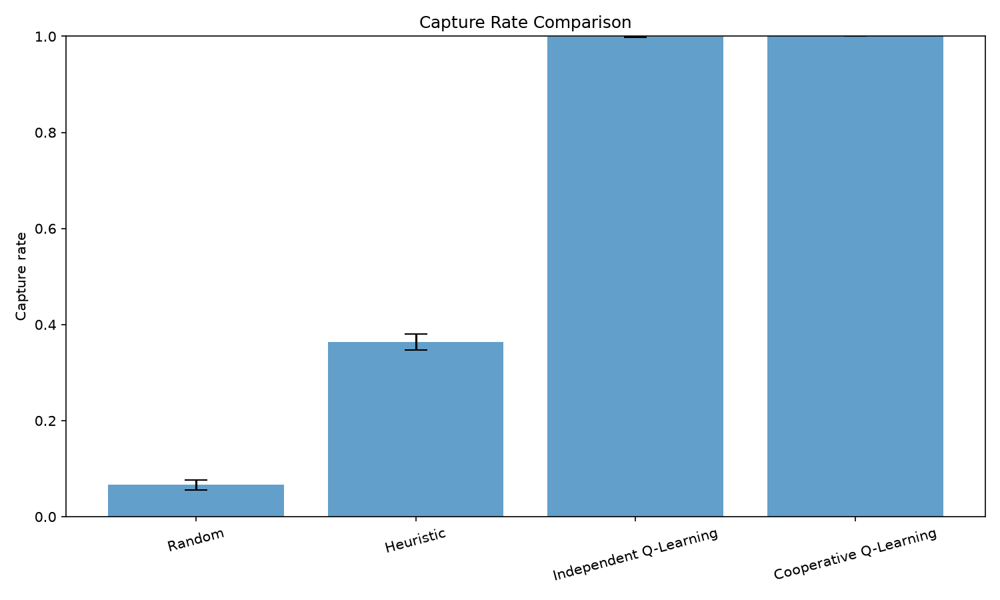
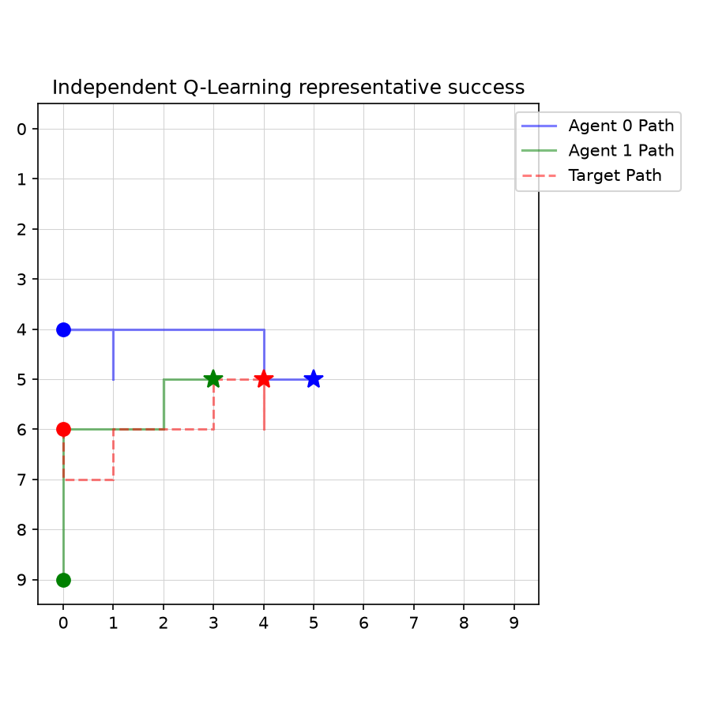
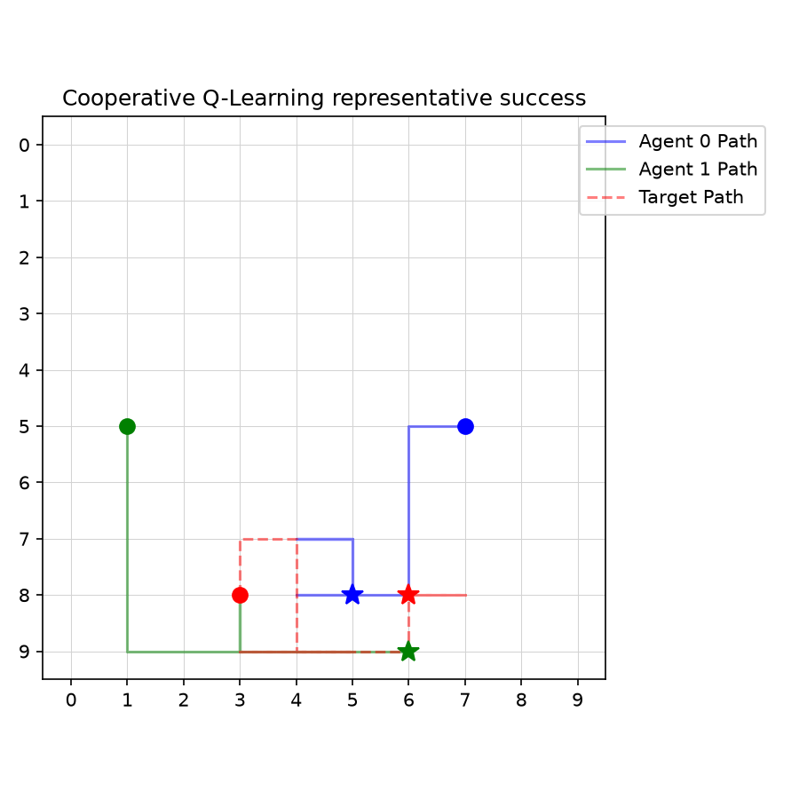

# Emergent Cooperation in Multi-Agent Reinforcement Learning for Target Capture

This repository is an interpretable multi-agent reinforcement learning study in a deterministic, seeded GridWorld. Two hunters pursue a moving random target. Capture occurs when both hunters are Manhattan-adjacent to the target at the same time.

## Current status

Phases 0–12 are implemented and validated:

- GridWorld, movement, collision handling, target policy, capture, and rendering
- team reward and non-learning Random and Heuristic baselines
- Independent Q-Learning with one table per hunter
- Shared-Policy Cooperative Q-Learning with one table used by both hunters
- five-seed quantitative comparison
- frozen-policy trajectory recording, behavioral metrics, plots, and GIFs
- deterministic reproduction checks for raw data, training histories, summaries, and checkpoints

Deep MARL, learned communication, continuous actions, and statistical hypothesis testing are outside the current scope.

## Environment and reward

The default experiment uses a `10 × 10` grid, a 100-step limit, two hunters, and one target. Every entity chooses from `UP`, `DOWN`, `LEFT`, `RIGHT`, and `STAY`. Hunter actions are chosen from the same pre-step state, applied sequentially, and followed by the target action. Entities cannot move outside the grid or into an occupied cell.

The shared team reward is:

```text
sum of both hunters' reductions in Manhattan distance to the moving target
+ 20 on capture
- 0.05 each step
```

Capture has zero Q-learning bootstrap value. Time-limit truncation retains bootstrap value.

## Learning methods

### Independent Q-Learning

Each hunter owns a separate sparse table. Its absolute state key is:

```text
(hunter_x, hunter_y, target_x, target_y)
```

### Shared-Policy Cooperative Q-Learning

Two logical hunter wrappers use one sparse Q-table and one policy architecture. Each hunter encodes the same environment state from its own perspective:

```text
(target_dx, target_dy, teammate_dx, teammate_dy)
```

Both actions are selected before the environment step. The resulting team reward updates the shared table once for each hunter transition.

Both methods use seeded epsilon-greedy action selection with random tie-breaking. Evaluation sets epsilon to zero and treats unseen states as zero-valued without adding them to a table.

## Reproduced Phase 11 protocol

- training seeds: `0, 1, 2, 3, 4`
- learning episodes: 5,000 per method and seed
- evaluation episodes: 500 per method and seed
- evaluation seed range: 10,000,000–10,002,499
- evaluation uses frozen policies and the same environment seeds for every method
- uncertainty: mean ± sample standard deviation across five independent seed-level estimates

Two complete executions produced byte-identical raw CSVs, training histories, summary tables, curve-source data, and all 15 learned checkpoints.

### Quantitative results

| Method | Capture rate | Episode length | Capture time on successes | Episode reward |
|---|---:|---:|---:|---:|
| Random | 0.0660 ± 0.0101 | 96.1988 ± 0.4606 | 42.1298 ± 2.7820 | -2.5575 ± 0.5226 |
| Heuristic | 0.3636 ± 0.0162 | 66.4816 ± 1.5012 | 7.8159 ± 0.1103 | 14.0743 ± 0.4557 |
| Independent Q-Learning | 0.9992 ± 0.0011 | 20.2772 ± 0.7763 | 20.2131 ± 0.8073 | 30.3193 ± 0.0657 |
| Cooperative Q-Learning | 1.0000 ± 0.0000 | 16.8412 ± 0.4470 | 16.8412 ± 0.4470 | 30.5079 ± 0.0755 |

Both learned methods captured the target in nearly every episode. Under this protocol, the shared-policy method completed episodes about 3.44 steps sooner on average than Independent Q-Learning. These descriptive results do not establish statistical significance or isolate whether teammate-relative state, parameter sharing, or their combination caused the difference.

The exact summary is in [comparison_summary.csv](results/reproducibility/summaries/comparison_summary.csv), with seed-level values in [per_seed_summary.csv](results/reproducibility/summaries/per_seed_summary.csv).



## Phase 12 behavioral analysis

Behavioral analysis reused the five reproduced checkpoint sets and the same 500 evaluation episodes per seed. Policies remained frozen, and every recorded transition includes the actual hunter actions, target action, reward, positions, termination flags, checkpoint identity, and selection rule.

### Behavioral metrics

Metrics are averaged within each training seed first, followed by mean ± sample standard deviation across five seed-level estimates.

| Method | Mean target distance | Hunter separation | Simultaneous adjacency fraction | Distinct-side fraction |
|---|---:|---:|---:|---:|
| Random | 6.5217 ± 0.0262 | 6.6673 ± 0.0430 | 0.0038 ± 0.0003 | 0.0038 ± 0.0003 |
| Heuristic | 2.6032 ± 0.0314 | 2.6826 ± 0.1108 | 0.0501 ± 0.0025 | 0.0501 ± 0.0025 |
| Independent Q-Learning | 3.5364 ± 0.0316 | 4.0453 ± 0.1273 | 0.0700 ± 0.0033 | 0.0700 ± 0.0033 |
| Cooperative Q-Learning | 4.0687 ± 0.0408 | 4.4486 ± 0.1180 | 0.0780 ± 0.0027 | 0.0780 ± 0.0027 |

The shared-policy agents captured sooner while maintaining greater mean separation than the independent agents. Their simultaneous-adjacency fraction was also higher. Since episodes terminate immediately at capture, simultaneous adjacency largely reflects capture frequency and episode duration. Since collision handling already prevents hunters from occupying the same cell, the current distinct-side indicator equals simultaneous adjacency in this environment. These metrics provide evidence consistent with more efficient positioning, but they do not independently demonstrate stable roles or a general pincer strategy.

The full seed-level table is [behavioral_seed_summary.csv](results/reproducibility/behavioral/behavioral_seed_summary.csv).

### Representative episodes

A representative success is the successful episode whose capture time is closest to that method's median successful capture time. Ties are resolved by training seed and then evaluation seed. A learned-policy failure is the first failure under the same seed ordering.

| Method | Selected success | Evaluation seed | Length |
|---|---:|---:|---:|
| Random | training seed 1 | 10,000,904 | 38 |
| Heuristic | training seed 0 | 10,000,063 | 8 |
| Independent Q-Learning | training seed 0 | 10,000,009 | 17 |
| Cooperative Q-Learning | training seed 0 | 10,000,010 | 15 |

Independent Q-Learning failed in 2 of 2,500 evaluation episodes. The saved failure is training seed 0, evaluation seed 10,000,451; both hunters stayed relatively close to the target but never became adjacent simultaneously before the 100-step truncation. Cooperative Q-Learning had no failures in the complete 2,500-episode dataset, so no cooperative failure trajectory was fabricated.

| Independent Q-Learning | Shared-Policy Cooperative Q-Learning |
|---|---|
|  |  |
| [Representative success GIF](results/reproducibility/gifs/independent_q_learning_success.gif) | [Representative success GIF](results/reproducibility/gifs/cooperative_q_learning_success.gif) |

Selection details and trajectory paths are recorded in [representative_selection.csv](results/reproducibility/behavioral/representative_selection.csv). Machine-readable trajectories are under [results/reproducibility/trajectories](results/reproducibility/trajectories/).

## Reproduce the results

Create an environment and install the declared dependencies:

```bash
python -m venv .venv/reproduction
.venv/reproduction/Scripts/python -m pip install -r requirements.txt
```

Run the complete test suite:

```bash
.venv/reproduction/Scripts/python -m pytest -q
```

Run two complete quantitative experiments:

```bash
.venv/reproduction/Scripts/python -m experiments.run_comparison --grid-size 10 --max-steps 100 --train-episodes 5000 --eval-episodes 500 --seeds 0 1 2 3 4 --output-dir results/validation/run_a
.venv/reproduction/Scripts/python -m experiments.run_comparison --grid-size 10 --max-steps 100 --train-episodes 5000 --eval-episodes 500 --seeds 0 1 2 3 4 --output-dir results/validation/run_b
```

Generate behavioral evidence from each checkpoint set:

```bash
.venv/reproduction/Scripts/python -m experiments.generate_behavioral_examples --grid-size 10 --max-steps 100 --eval-episodes 500 --seeds 0 1 2 3 4 --output-dir results/validation/run_a
.venv/reproduction/Scripts/python -m experiments.generate_behavioral_examples --grid-size 10 --max-steps 100 --eval-episodes 500 --seeds 0 1 2 3 4 --output-dir results/validation/run_b
```

Validate and publish lightweight evidence:

```bash
.venv/reproduction/Scripts/python -m experiments.reproducibility --run-a results/validation/run_a --run-b results/validation/run_b --seeds 0 1 2 3 4 --train-episodes 5000 --eval-episodes 500 --publish-dir results/reproducibility
```

Full raw results and checkpoints remain ignored under `results/validation/`. The tracked evidence bundle contains configuration, summaries, plot-source data, plots, representative trajectories, GIFs, and a SHA-256 [artifact manifest](results/reproducibility/artifact_manifest.json).
The independent-run comparison fingerprint and its checked scope are recorded in [reproduction_verification.json](results/reproducibility/reproduction_verification.json).

## Limitations

- The environment has only two homogeneous hunters on one small grid.
- The moving target follows one seeded random policy.
- Parameter sharing and teammate-relative observations change together, so this experiment cannot attribute the result to either factor alone.
- The behavioral indicators are simple and partly constrained by the capture and collision rules.
- Representative animations are deterministic examples selected by a documented rule; they do not replace the 2,500-episode-per-method summaries.
- No hypothesis test, confidence interval, reward ablation, alternate target policy, or larger-team study is included.

The repository is ready for Phase 13 reward ablation and controlled tests of which design choices drive the observed performance.
